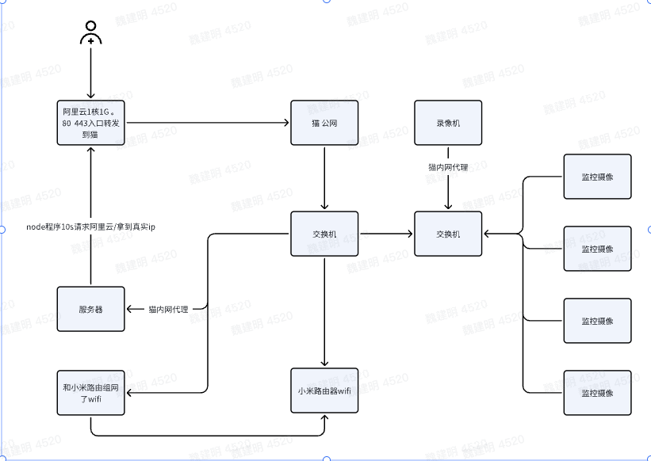

## 满足的条件和现有的设备资源

地点：河北、电信网络。

设备：

- 电信服务商自带光猫。已申请公网。（不是专线想听怎么申请的），请看下会分解。

- 红米路由器

- 海康录像机一台，很老的款。找教程的时候明显因为老款的原因内容好多不一致。

- 4台摄像头已按照好的，萤石云的。也是特别便宜的。（我怀疑父母被装监控的欺骗了 2010年  2000，现在淘宝 4个头支持 poe交换机，600-800，对了原监控没有交换机用的家里以前淘汰的路由器。）

- 小米交换机8口一台 9x元

- 绿联交换机8口一套 8x元 （这个全金属外壳）

- 超五类100米网线

- 六类网线100米网线 

- 水晶头若干

- 网线钳，最好整吧带测试的。 

- 华为服务器一台

## 连线如图

## 已实现

- [x] 已完成网线连接，功能全部正常。

- [x] 光猫已经做内网ip的代理，远程已经可以访问服务器和海康的摄像机。

- [x] 海康的摄像机内部是有内网穿透海康自己软件的功能。目前在使用中。

- [x] 4个摄像机的流在内网已经全部搜索出来。后期可以对接自己监控服务，不在使用海康的摄像机。

- [ ] 公网动态ip问题。解决方案有很多，我采用了上图描述的方案。

- [ ] 做小程序服务是不行的，因为个人的公网ip是没有80 和 443 端口的。

## 下期重点

- 解决动态ip问题
- 解决 80 433需要认证的问题
- 会涉及云服务器购买使用搭建
- 会涉及node服务开发
- 会涉及docker部署
- 会涉及出一点点服务器的知识
- 会涉及nginx的一丢丢知识

# 声明

我是web前端，对网管（网线、设备、交换机），和运维（部署、服务器维护），服务端的专业知识是一知半解的。只有知道的水平。很多错误的地方请指正。
